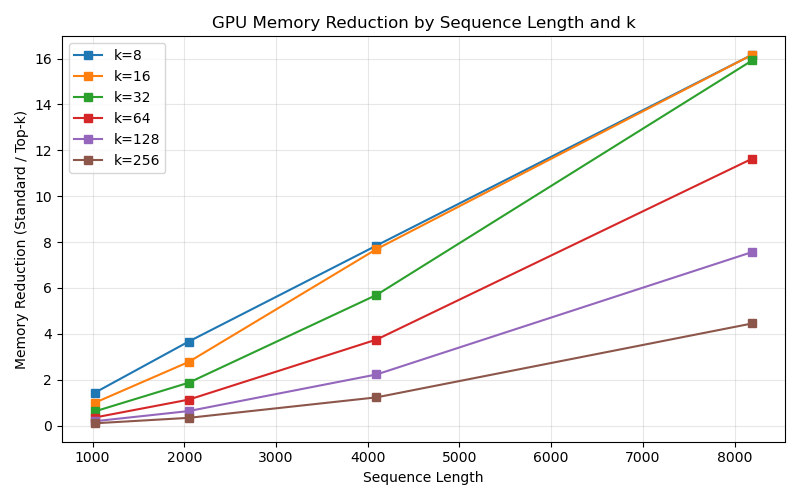
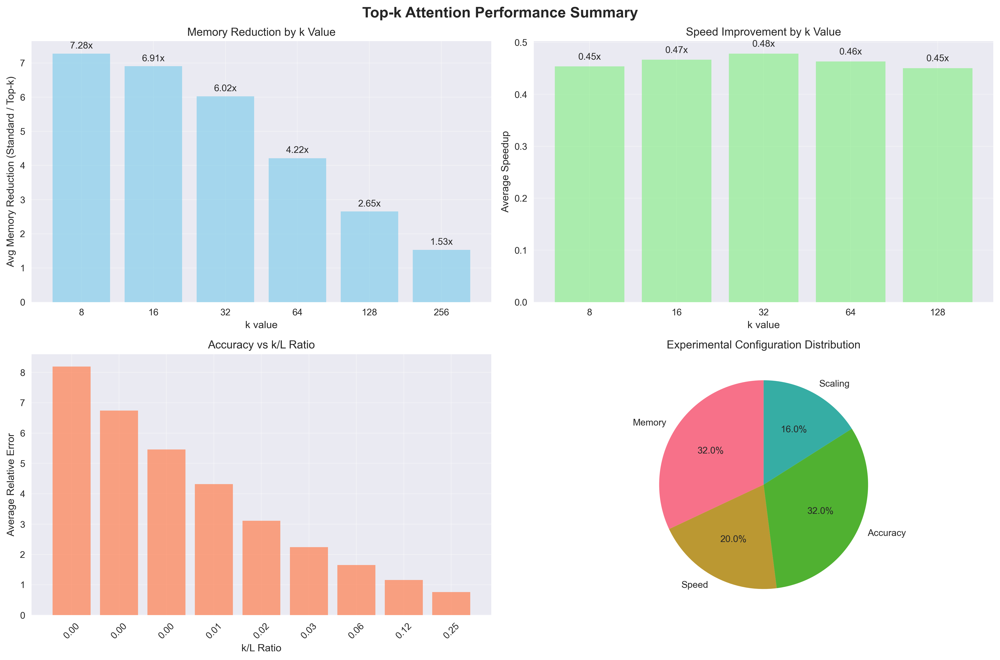

# Top-k Attention vs Standard Attention: A Comparison

This repository provides a comprehensive comparison between **Top-k Attention** and **Standard Attention** mechanisms in Transformers, based on the paper ["Memory-efficient Transformers via Top-k Attention"](https://arxiv.org/pdf/2106.06899.pdf) by Gupta et al. (2021).

---

## 📊 What is Top-k Attention?

Top-k attention addresses the quadratic memory complexity of standard attention by:

1. **Selective attention**: For each query, only keep the k largest attention scores
2. **Query chunking**: Process queries in chunks to reduce memory usage
3. **Input checkpointing**: Custom backward pass that avoids caching large matrices

Standard attention has O(L²) memory complexity, Top-k attention reduces this to O(L·k) where L is the sequence length and k ≪ L.

---

## 📁 Repository Overview

| Folder/File         | Description                                                      |
|--------------------|------------------------------------------------------------------|
| src/               | Core attention implementations           |
| results/           | Benchmark results and generated plots                      |
| experiments/       | Main experiment and benchmarking scripts                          |
| examples/          | Example scripts for plotting and usage                            |


---

## 🧪 Benchmarks

Run the following experiments to evaluate Top-k vs Standard Attention:

| Experiment   | What it Measures                |
|-------------|----------------------------------|
| Memory      | Peak GPU memory usage            |
| Speed       | Forward/backward pass time       |
| Accuracy    | Output similarity (cosine similarity, relative error) |
| Scaling     | Performance on long sequences    |
| All         | Full suite (all above)           |

To run any experiment, use `python experiments/comprehensive_benchmark.py --tag <experiment>`, replacing `<experiment>` with `memory`, `speed`, `accuracy`, `scaling`, or `full`.

- Results are saved as JSON in `results/` and plots in `results/plots/`.

---

## 🔬 Understanding the Implementation

### Top-k Attention Algorithm

```python
def topk_attention(Q, K, V, k):
    """
    Computes top-k attention efficiently
    
    Args:
        Q: Query matrix [batch, seq_len, d_model]
        K: Key matrix [batch, seq_len, d_model] 
        V: Value matrix [batch, seq_len, d_model]
        k: Number of top attention scores to keep
    """
    # 1. Compute attention scores
    scores = torch.matmul(Q, K.transpose(-2, -1)) / math.sqrt(d_model)
    
    # 2. Get top-k scores and indices
    topk_scores, topk_indices = torch.topk(scores, k=k, dim=-1)
    
    # 3. Apply softmax only to top-k scores
    topk_weights = torch.softmax(topk_scores, dim=-1)
    
    # 4. Gather corresponding values and compute output
    topk_values = torch.gather(V.unsqueeze(-3).expand_as(scores.unsqueeze(-1)), 
                              dim=-2, 
                              index=topk_indices.unsqueeze(-1).expand(-1,-1,-1,d_model))
    
    # 5. Weighted sum of top-k values
    output = torch.sum(topk_weights.unsqueeze(-1) * topk_values, dim=-2)
    return output
```

### Query Chunking for Memory Efficiency

```python
def chunked_topk_attention(Q, K, V, k, chunk_size=1024):
    """
    Process queries in chunks to reduce memory usage
    """
    outputs = []
    for i in range(0, Q.size(1), chunk_size):
        chunk_Q = Q[:, i:i+chunk_size]
        chunk_output = topk_attention(chunk_Q, K, V, k)
        outputs.append(chunk_output)
    return torch.cat(outputs, dim=1)
```

### Input Checkpointing for Memory-Efficient Backward Pass

Instead of storing all intermediate activations for the backward pass, this approach recomputes them as needed during backpropagation, saving memory at the cost of additional computation.

---

## Experimental Setup

- **Model**: Multi-head attention (Standard and Top-k)
- **Model dimension (d_model)**: 512
- **Number of heads (n_heads)**: 8
- **Batch size**: 1
- **Sequence lengths**: 1024, 2048, 4096, 8192
- **k values**: 8, 16, 32, 64, 128, 256
- **Metrics**: Speed, memory usage, accuracy, scaling
- **Platform**: Tested on NVIDIA Tesla P100 GPU 

---

## 📈 Visualization Example

### Memory Reduction by Top-k Attention




### Comprehensive Summary




---

## 🧩 Implementation & Data-Driven Comparison
A key goal of this project is to benchmark Top-k Attention as described in the 
paper ["Memory-efficient Transformers via Top-k Attention"](https://arxiv.org/pdf/2106.06899.pdf). Actual memory and speed improvements depend heavily on implementation details. Here is a comprehensive comparison:

### Implementation Comparison
| Implementation                | Memory Reduction | Speedup |
|-------------------------------|--------------------------|---------|
| **This repo**  | 1.4–16.2x                | 0.29–0.77x     |
| **Author's public repo**      | 2–11x                   | 0.014–1.51x     |


### Memory Reduction vs Sequence Length (k=8)
| seq_len | This Repo | Author's Public Repo |
|---------|-------------------|---------------------------|
| 1024    | 1.4x              | 2.2x                      |
| 2048    | 3.7x              | 2.6x                      |
| 4096    | 7.8x              | 5.4x                      |
| 8192    | 16.2x             | 11.0x                     |


### Relative Error by k (Averaged Across Sequence Lengths)
|   k   | This Repo | Author's Public Repo |
|-------|----------------------------|-------------------------------|
|   8   |        6.7                |         17.3                 |
|  16   |        5.0                |         16.8                 |
|  32   |        3.6                |         16.1                 |
|  64   |        2.3                |         15.3                 |
| 128   |        1.6                |         14.2                 |
| 256   |        1.1                |         13.1                 |


- Despite the memory savings, top-k attention still computes the full quadratic-cost QKᵀ product upfront, which usually results in higher compute time due to the overhead from topk and gather operations.


---

## 🙏 Acknowledgments 

- Original paper: ["Memory-efficient Transformers via Top-k Attention" (Gupta et al., 2021)](https://arxiv.org/pdf/2106.06899.pdf)
- Original implementation: [ag1988/top_k_attention](https://github.com/ag1988/top_k_attention)
- Standard attention: ["Attention Is All You Need" (Vaswani et al., 2017)](https://arxiv.org/abs/1706.03762)

